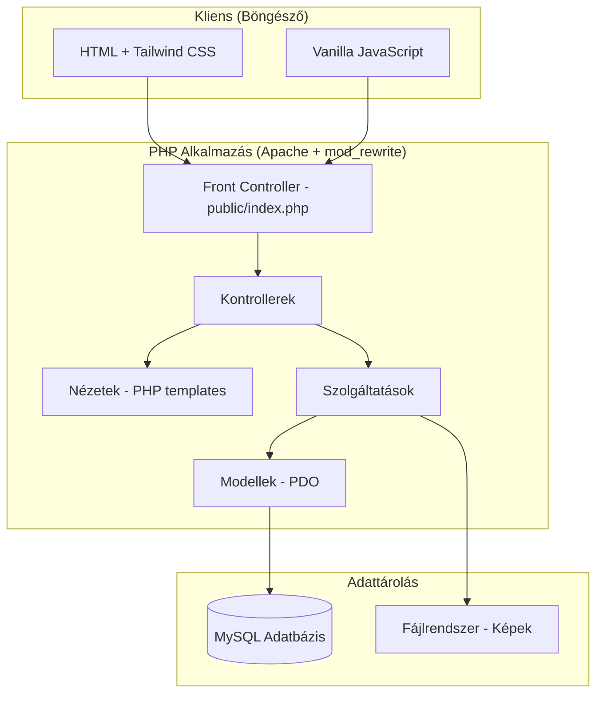
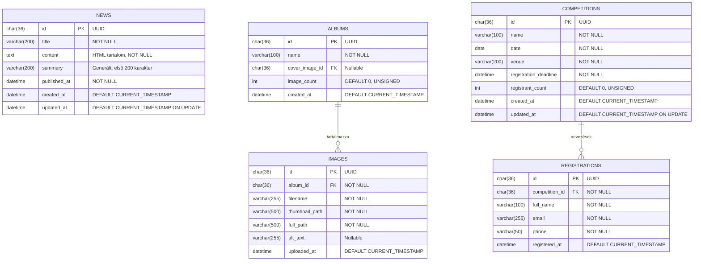

# Design Document: Billiard Website

## Overview

A Magyar Biliárd Weboldal egy hagyományos PHP alapú, reszponzív webalkalmazás, amely három fő modult tartalmaz: hírkezelés, fotógaléria és versenynevezési rendszer. Az alkalmazás egyszerű MVC struktúrában épül fel PHP-vel, MySQL adatbázissal, és bármely standard LAMP/WAMP hosting környezetben futtatható. A frontend HTML/CSS/JavaScript kombinációt használ (Tailwind CSS-sel stilizálva), amelyet a PHP renderel szerver-oldalon.

### Technológiai döntések

| Terület | Választás | Indoklás |
|---------|-----------|----------|
| Backend nyelv | PHP 8.1+ | Széles körű hosting támogatás, egyszerű telepítés, natív MySQL támogatás |
| Architektúra | Egyszerű MVC (keretrendszer nélkül) | Könnyű karbantartás, nincs keretrendszer-függőség, átlátható struktúra |
| Adatbázis | MySQL 8.0+ | Robusztus, skálázható, LAMP stack része, minden shared hosting támogatja |
| DB hozzáférés | PDO (PHP Data Objects) | Prepared statements (SQL injection védelem), adatbázis-agnosztikus interfész |
| Stíluskezelés | Tailwind CSS (CDN) | Utility-first megközelítés, reszponzív tervezés egyszerűsítése, nincs build lépés |
| Képkezelés | PHP GD Library | Beépített PHP extension, bélyegkép generálás (200x200px), nincs külső függőség |
| E-mail küldés | PHPMailer | Megbízható, SMTP támogatás, HTML e-mailek, széles körben használt |
| Validáció | PHP szerveroldali validáció (saját Validator osztály) | Egyszerű, átlátható, nincs külső függőség |
| Rich text szerkesztő | TinyMCE (CDN) | Érett, jól dokumentált, egyszerű integráció, magyar lokalizáció |
| Tesztelés | PHPUnit + Eris (property-based testing) | Szabványos PHP tesztelési keretrendszer |
| Frontend JS | Vanilla JavaScript | Minimális kliens-oldali logika (lightbox, form validation, hamburger menü), nincs build lépés |
| Hosting | Standard shared hosting (LAMP/WAMP) | Olcsó, széles körben elérhető, egyszerű deployment |

## Architecture

### Magas szintű architektúra



### Alkalmazás rétegek


### Könyvtárstruktúra

```
/
├── public/                     → Web root (DocumentRoot)
│   ├── index.php              → Front controller / Router
│   ├── .htaccess              → URL rewriting (Apache mod_rewrite)
│   ├── assets/
│   │   ├── css/
│   │   │   └── app.css        → Egyéni stílusok (Tailwind kiegészítés)
│   │   └── js/
│   │       ├── app.js         → Általános JS (hamburger menü, form validáció)
│   │       └── gallery.js     → Galéria-specifikus JS (lightbox, swipe)
│   └── uploads/
│       └── albums/
│           └── {albumId}/
│               ├── full/      → Eredeti méretű képek
│               └── thumb/     → 200x200px bélyegképek
├── src/
│   ├── Controllers/
│   │   ├── HomeController.php
│   │   ├── NewsController.php
│   │   ├── GalleryController.php
│   │   ├── CompetitionController.php
│   │   └── AdminController.php
│   ├── Models/
│   │   ├── News.php
│   │   ├── Album.php
│   │   ├── Image.php
│   │   ├── Competition.php
│   │   └── Registration.php
│   ├── Services/
│   │   ├── NewsService.php
│   │   ├── GalleryService.php
│   │   ├── CompetitionService.php
│   │   ├── ImageService.php
│   │   ├── EmailService.php
│   │   └── ValidationService.php
│   ├── Views/
│   │   ├── layouts/
│   │   │   ├── main.php       → Fő layout (header, nav, footer)
│   │   │   └── admin.php      → Admin layout
│   │   ├── partials/
│   │   │   ├── header.php
│   │   │   ├── navigation.php
│   │   │   └── footer.php
│   │   ├── home/
│   │   │   └── index.php      → Főoldal (hírlista)
│   │   ├── news/
│   │   │   └── show.php       → Hír részletes nézet
│   │   ├── gallery/
│   │   │   ├── index.php      → Album lista
│   │   │   └── show.php       → Album képei
│   │   ├── competitions/
│   │   │   ├── index.php      → Verseny lista
│   │   │   └── register.php   → Nevezési űrlap
│   │   ├── admin/
│   │   │   ├── dashboard.php
│   │   │   ├── news/
│   │   │   │   ├── index.php
│   │   │   │   ├── create.php
│   │   │   │   └── edit.php
│   │   │   ├── gallery/
│   │   │   │   ├── index.php
│   │   │   │   └── upload.php
│   │   │   └── competitions/
│   │   │       ├── index.php
│   │   │       ├── create.php
│   │   │       ├── edit.php
│   │   │       └── registrations.php
│   │   └── errors/
│   │       ├── 404.php
│   │       └── 500.php
│   └── Core/
│       ├── Database.php       → PDO singleton/connection
│       ├── Router.php         → URL routing
│       ├── Validator.php      → Validációs osztály
│       ├── Session.php        → Session kezelés (admin auth)
│       ├── AppException.php   → Egyedi exception osztály
│       └── helpers.php        → Segédfüggvények (escape, redirect, flash, stb.)
├── config/
│   ├── database.php           → DB kapcsolat beállítások
│   ├── app.php                → Alkalmazás beállítások
│   └── mail.php               → SMTP beállítások (PHPMailer)
├── database/
│   └── migrations/
│       └── 001_create_tables.sql → Adatbázis séma
├── tests/
│   ├── Unit/
│   │   ├── NewsServiceTest.php
│   │   ├── GalleryServiceTest.php
│   │   ├── CompetitionServiceTest.php
│   │   ├── ValidationServiceTest.php
│   │   └── ImageServiceTest.php
│   ├── Properties/
│   │   ├── NewsPropertiesTest.php
│   │   ├── GalleryPropertiesTest.php
│   │   ├── CompetitionPropertiesTest.php
│   │   └── NavigationPropertiesTest.php
│   ├── Integration/
│   │   └── EmailServiceTest.php
│   ├── bootstrap.php
│   └── TestCase.php
├── vendor/                     → Composer függőségek
├── composer.json
├── phpunit.xml
└── README.md
```

### Útvonal struktúra (URL Routing)

Az alkalmazás Apache `.htaccess` mod_rewrite szabályokkal biztosít szép URL-eket:

```apache
# public/.htaccess
RewriteEngine On
RewriteCond %{REQUEST_FILENAME} !-f
RewriteCond %{REQUEST_FILENAME} !-d
RewriteRule ^(.*)$ index.php [QSA,L]
```

**Publikus útvonalak:**

```
GET  /                          → HomeController@index (legfrissebb hírek)
GET  /hirek/{id}                → NewsController@show (hír részletes nézet)
GET  /galeria                   → GalleryController@index (albumok listája)
GET  /galeria/{albumId}         → GalleryController@show (album képei)
GET  /nevezes                   → CompetitionController@index (nyitott versenyek)
GET  /nevezes/{versenyId}       → CompetitionController@showForm (nevezési űrlap)
POST /nevezes/{versenyId}       → CompetitionController@submitRegistration
```

**Admin útvonalak (session-alapú autentikáció szükséges):**

```
GET  /admin                     → AdminController@dashboard
GET  /admin/login               → AdminController@loginForm
POST /admin/login               → AdminController@login
GET  /admin/logout              → AdminController@logout

GET  /admin/hirek               → AdminController@newsList
GET  /admin/hirek/uj            → AdminController@newsCreate
POST /admin/hirek/uj            → AdminController@newsStore
GET  /admin/hirek/{id}/szerkeszt → AdminController@newsEdit
POST /admin/hirek/{id}/szerkeszt → AdminController@newsUpdate
POST /admin/hirek/{id}/torol    → AdminController@newsDelete

GET  /admin/galeria             → AdminController@albumList
POST /admin/galeria/uj          → AdminController@albumStore
POST /admin/galeria/{id}/feltolt → AdminController@imageUpload
POST /admin/galeria/kep/{id}/torol → AdminController@imageDelete

GET  /admin/versenyek           → AdminController@competitionList
GET  /admin/versenyek/uj        → AdminController@competitionCreate
POST /admin/versenyek/uj        → AdminController@competitionStore
GET  /admin/versenyek/{id}/szerkeszt → AdminController@competitionEdit
POST /admin/versenyek/{id}/szerkeszt → AdminController@competitionUpdate
POST /admin/versenyek/{id}/torol → AdminController@competitionDelete
GET  /admin/versenyek/{id}/nevezesek → AdminController@registrationList
GET  /admin/versenyek/{id}/export → AdminController@exportCsv
```

## Components and Interfaces

### Core osztályok

```php
// src/Core/Database.php
class Database {
    private static ?PDO $instance = null;

    public static function getConnection(): PDO {
        if (self::$instance === null) {
            $config = require __DIR__ . '/../../config/database.php';
            self::$instance = new PDO(
                "mysql:host={$config['host']};dbname={$config['dbname']};charset=utf8mb4",
                $config['username'],
                $config['password'],
                [
                    PDO::ATTR_ERRMODE => PDO::ERRMODE_EXCEPTION,
                    PDO::ATTR_DEFAULT_FETCH_MODE => PDO::FETCH_ASSOC,
                    PDO::ATTR_EMULATE_PREPARES => false,
                ]
            );
        }
        return self::$instance;
    }

    /** Teszteléshez: connection injektálás */
    public static function setConnection(PDO $pdo): void {
        self::$instance = $pdo;
    }
}

// src/Core/Router.php
class Router {
    private array $routes = [];

    public function get(string $pattern, string $handler): void;
    public function post(string $pattern, string $handler): void;
    public function dispatch(string $method, string $uri): void;
    private function matchRoute(string $uri, string $pattern): ?array;
}

// src/Core/Validator.php
class Validator {
    private array $errors = [];

    public function required(string $field, ?string $value, string $message): self;
    public function maxLength(string $field, ?string $value, int $max, string $message): self;
    public function minLength(string $field, ?string $value, int $min, string $message): self;
    public function email(string $field, ?string $value, string $message): self;
    public function date(string $field, ?string $value, string $message): self;
    public function fileType(string $field, array $allowed, string $actualType, string $message): self;
    public function fileSize(string $field, int $maxBytes, int $actualSize, string $message): self;
    public function isValid(): bool;
    public function getErrors(): array;
    public function getError(string $field): ?string;
}

// src/Core/Session.php
class Session {
    public static function start(): void;
    public static function isAdmin(): bool;
    public static function login(string $password): bool;
    public static function logout(): void;
    public static function flash(string $key, mixed $value): void;
    public static function getFlash(string $key): mixed;
}

// src/Core/helpers.php
function e(string $value): string;           // htmlspecialchars wrapper
function redirect(string $url): void;        // Header redirect
function asset(string $path): string;        // Asset URL generálás
function currentUrl(): string;               // Aktuális URL
function isActive(string $route): string;    // Aktív menüpont CSS class
```

### Szolgáltatási osztályok

```php
// src/Services/NewsService.php
class NewsService {
    public function __construct(private PDO $db) {}

    /** @return array<array{id:string, title:string, summary:string, published_at:string}> */
    public function getLatestNews(int $limit = 10): array;

    /** @return array{id:string, title:string, content:string, published_at:string}|null */
    public function getNewsById(string $id): ?array;

    /** @return array{id:string, title:string, content:string, summary:string, published_at:string} */
    public function createNews(string $title, string $content): array;

    /** @return array{id:string, title:string, content:string, summary:string, published_at:string} */
    public function updateNews(string $id, string $title, string $content): array;

    public function deleteNews(string $id): void;

    /** Summary generálás: HTML strip + első 200 karakter */
    private function generateSummary(string $content): string;
}

// src/Services/GalleryService.php
class GalleryService {
    public function __construct(private PDO $db, private ImageService $imageService) {}

    /** @return array<array{id:string, name:string, cover_image_id:string|null, image_count:int, created_at:string}> */
    public function getAlbums(): array;

    /** @return array<array{id:string, filename:string, thumbnail_path:string, full_path:string}> */
    public function getAlbumImages(string $albumId): array;

    /** @return array{id:string, name:string, created_at:string} */
    public function createAlbum(string $name): array;

    /** @return array{id:string, filename:string, thumbnail_path:string, full_path:string} */
    public function uploadImage(string $albumId, array $uploadedFile): array;

    public function deleteImage(string $imageId): void;
}

// src/Services/CompetitionService.php
class CompetitionService {
    public function __construct(private PDO $db, private EmailService $emailService) {}

    /** @return array<array{id:string, name:string, date:string, venue:string, registration_deadline:string, registrant_count:int}> */
    public function getOpenCompetitions(): array;

    /** @return array{id:string, name:string, date:string, venue:string, registration_deadline:string, registrant_count:int}|null */
    public function getCompetitionById(string $id): ?array;

    /** @return array{id:string, name:string, date:string, venue:string, registration_deadline:string} */
    public function createCompetition(array $data): array;

    /** @return array{id:string, name:string, date:string, venue:string, registration_deadline:string} */
    public function updateCompetition(string $id, array $data): array;

    public function deleteCompetition(string $id): void;

    /** @return array{id:string, competition_id:string, full_name:string, email:string, phone:string, registered_at:string} */
    public function registerForCompetition(string $competitionId, array $data): array;

    /** @return array<array{full_name:string, email:string, phone:string, registered_at:string}> */
    public function getRegistrations(string $competitionId): array;

    /** CSV string visszaadása (név, email, telefon oszlopokkal) */
    public function exportRegistrationsCsv(string $competitionId): string;

    public function checkDuplicateRegistration(string $competitionId, string $email): bool;
}

// src/Services/ImageService.php
class ImageService {
    /**
     * PHP GD library-vel 200x200px bélyegkép generálás
     * Arányosan átméretez, majd középre vágja 200x200-ra
     */
    public function createThumbnail(string $sourcePath, string $destPath, int $width = 200, int $height = 200): bool;

    public function isValidImageType(string $mimeType): bool;
    public function isValidFileSize(int $size, int $maxMB = 10): bool;
    public function deleteImageFiles(string $fullPath, string $thumbPath): void;
}

// src/Services/EmailService.php
use PHPMailer\PHPMailer\PHPMailer;

class EmailService {
    private array $config;

    public function __construct(array $smtpConfig) {
        $this->config = $smtpConfig;
    }

    /**
     * Visszaigazoló e-mail küldése PHPMailer-rel
     * Tartalom: verseny neve, dátuma, nevező adatai
     * Retry: max 3 kísérlet
     */
    public function sendRegistrationConfirmation(string $to, array $data): bool;
}

// src/Services/ValidationService.php
class ValidationService {
    public function validateNews(array $data): Validator;
    public function validateAlbum(array $data): Validator;
    public function validateRegistration(array $data): Validator;
    public function validateCompetition(array $data): Validator;
    public function validateImageUpload(array $file): Validator;
}
```

### Kontroller példák

```php
// src/Controllers/HomeController.php
class HomeController {
    private NewsService $newsService;

    public function index(): void {
        $news = $this->newsService->getLatestNews(10);
        $pageTitle = 'Főoldal - Magyar Biliárd';
        require __DIR__ . '/../Views/home/index.php';
    }
}

// src/Controllers/NewsController.php
class NewsController {
    private NewsService $newsService;

    public function show(string $id): void {
        $news = $this->newsService->getNewsById($id);
        if ($news === null) {
            http_response_code(404);
            require __DIR__ . '/../Views/errors/404.php';
            return;
        }
        $pageTitle = e($news['title']) . ' - Magyar Biliárd';
        require __DIR__ . '/../Views/news/show.php';
    }
}

// src/Controllers/CompetitionController.php
class CompetitionController {
    private CompetitionService $competitionService;
    private ValidationService $validationService;

    public function index(): void {
        $competitions = $this->competitionService->getOpenCompetitions();
        $pageTitle = 'Nevezés - Magyar Biliárd';
        require __DIR__ . '/../Views/competitions/index.php';
    }

    public function showForm(string $competitionId): void {
        $competition = $this->competitionService->getCompetitionById($competitionId);
        if ($competition === null) {
            http_response_code(404);
            require __DIR__ . '/../Views/errors/404.php';
            return;
        }
        $errors = [];
        $data = [];
        $pageTitle = 'Nevezés: ' . e($competition['name']);
        require __DIR__ . '/../Views/competitions/register.php';
    }

    public function submitRegistration(string $competitionId): void {
        $competition = $this->competitionService->getCompetitionById($competitionId);
        if ($competition === null) {
            http_response_code(404);
            require __DIR__ . '/../Views/errors/404.php';
            return;
        }

        // Határidő ellenőrzés
        if (new DateTime($competition['registration_deadline']) < new DateTime()) {
            $deadlinePassed = true;
            require __DIR__ . '/../Views/competitions/register.php';
            return;
        }

        $data = [
            'fullName' => trim($_POST['full_name'] ?? ''),
            'email' => trim($_POST['email'] ?? ''),
            'phone' => trim($_POST['phone'] ?? ''),
        ];

        // Validáció
        $validator = $this->validationService->validateRegistration($data);
        if (!$validator->isValid()) {
            $errors = $validator->getErrors();
            $pageTitle = 'Nevezés: ' . e($competition['name']);
            require __DIR__ . '/../Views/competitions/register.php';
            return;
        }

        // Duplikáció ellenőrzés
        if ($this->competitionService->checkDuplicateRegistration($competitionId, $data['email'])) {
            $duplicateError = true;
            $pageTitle = 'Nevezés: ' . e($competition['name']);
            require __DIR__ . '/../Views/competitions/register.php';
            return;
        }

        // Nevezés rögzítése
        $registration = $this->competitionService->registerForCompetition($competitionId, $data);
        Session::flash('success', 'Sikeres nevezés! Visszaigazoló e-mailt küldtünk.');
        redirect("/nevezes/{$competitionId}?success=1");
    }
}
```

### Nézet (View) példák

```php
<!-- src/Views/layouts/main.php -->
<!DOCTYPE html>
<html lang="hu">
<head>
    <meta charset="UTF-8">
    <meta name="viewport" content="width=device-width, initial-scale=1.0">
    <title><?= e($pageTitle ?? 'Magyar Biliárd') ?></title>
    <script src="https://cdn.tailwindcss.com"></script>
    <script>
        tailwind.config = {
            theme: {
                extend: {
                    colors: {
                        'billiard-green': { 700: '#15803d', 800: '#166534', 900: '#14532d' },
                        'billiard-gold': { 400: '#facc15', 500: '#eab308', 600: '#ca8a04' },
                    }
                }
            }
        }
    </script>
    <link rel="stylesheet" href="/assets/css/app.css">
</head>
<body class="bg-gray-50 min-h-screen flex flex-col">
    <?php require __DIR__ . '/../partials/header.php'; ?>
    <?php require __DIR__ . '/../partials/navigation.php'; ?>

    <main class="container mx-auto px-4 py-8 flex-1">
        <?php if ($flash = Session::getFlash('success')): ?>
            <div class="bg-green-100 border border-green-400 text-green-700 px-4 py-3 rounded mb-4">
                <?= e($flash) ?>
            </div>
        <?php endif; ?>
        <?= $content ?? '' ?>
    </main>

    <?php require __DIR__ . '/../partials/footer.php'; ?>
    <script src="/assets/js/app.js"></script>
</body>
</html>
```

```php
<!-- src/Views/partials/navigation.php -->
<nav class="bg-billiard-green-800 text-white">
    <div class="container mx-auto px-4 flex items-center justify-between h-16">
        <a href="/" class="text-billiard-gold-400 font-bold text-xl">Magyar Biliárd</a>

        <!-- Hamburger gomb (mobil) -->
        <button id="menu-toggle" class="md:hidden p-2 min-w-[44px] min-h-[44px]" aria-label="Menü">
            <svg class="w-6 h-6" fill="none" stroke="currentColor" viewBox="0 0 24 24">
                <path stroke-linecap="round" stroke-linejoin="round" stroke-width="2" d="M4 6h16M4 12h16M4 18h16"/>
            </svg>
        </button>

        <!-- Navigációs menü -->
        <ul id="nav-menu" class="hidden md:flex space-x-6">
            <li><a href="/" class="<?= isActive('/') ?> min-h-[44px] flex items-center px-3 py-2 rounded hover:bg-billiard-green-700">Hírek</a></li>
            <li><a href="/galeria" class="<?= isActive('/galeria') ?> min-h-[44px] flex items-center px-3 py-2 rounded hover:bg-billiard-green-700">Galéria</a></li>
            <li><a href="/nevezes" class="<?= isActive('/nevezes') ?> min-h-[44px] flex items-center px-3 py-2 rounded hover:bg-billiard-green-700">Nevezés</a></li>
        </ul>
    </div>

    <!-- Mobil menü (rejtett alapértelmezés) -->
    <div id="mobile-menu" class="hidden md:hidden px-4 pb-4">
        <a href="/" class="block py-3 min-h-[44px] <?= isActive('/') ?>">Hírek</a>
        <a href="/galeria" class="block py-3 min-h-[44px] <?= isActive('/galeria') ?>">Galéria</a>
        <a href="/nevezes" class="block py-3 min-h-[44px] <?= isActive('/nevezes') ?>">Nevezés</a>
    </div>
</nav>
```

### Validációs szabályok

```php
// src/Services/ValidationService.php
class ValidationService {

    public function validateNews(array $data): Validator {
        $v = new Validator();
        $v->required('title', $data['title'] ?? null, 'A cím megadása kötelező')
          ->maxLength('title', $data['title'] ?? null, 200, 'A cím maximum 200 karakter lehet')
          ->required('content', $data['content'] ?? null, 'A tartalom megadása kötelező');
        return $v;
    }

    public function validateAlbum(array $data): Validator {
        $v = new Validator();
        $name = trim($data['name'] ?? '');
        $v->required('name', $name ?: null, 'Az album neve kötelező')
          ->maxLength('name', $name, 100, 'Az album neve maximum 100 karakter lehet');
        return $v;
    }

    public function validateRegistration(array $data): Validator {
        $v = new Validator();
        $v->required('fullName', $data['fullName'] ?? null, 'A név megadása kötelező')
          ->maxLength('fullName', $data['fullName'] ?? null, 100, 'A név maximum 100 karakter lehet')
          ->required('email', $data['email'] ?? null, 'Az e-mail cím megadása kötelező')
          ->email('email', $data['email'] ?? null, 'Érvénytelen e-mail formátum')
          ->required('phone', $data['phone'] ?? null, 'A telefonszám megadása kötelező');
        return $v;
    }

    public function validateCompetition(array $data): Validator {
        $v = new Validator();
        $v->required('name', $data['name'] ?? null, 'A verseny neve kötelező')
          ->maxLength('name', $data['name'] ?? null, 100, 'A név maximum 100 karakter lehet')
          ->required('date', $data['date'] ?? null, 'A dátum megadása kötelező')
          ->date('date', $data['date'] ?? null, 'Érvénytelen dátum formátum')
          ->required('venue', $data['venue'] ?? null, 'A helyszín megadása kötelező')
          ->maxLength('venue', $data['venue'] ?? null, 200, 'A helyszín maximum 200 karakter')
          ->required('registrationDeadline', $data['registrationDeadline'] ?? null, 'A nevezési határidő megadása kötelező')
          ->date('registrationDeadline', $data['registrationDeadline'] ?? null, 'Érvénytelen határidő formátum');
        return $v;
    }

    public function validateImageUpload(array $file): Validator {
        $v = new Validator();
        $allowedTypes = ['image/jpeg', 'image/png'];
        $maxSize = 10 * 1024 * 1024; // 10 MB

        $v->fileType('image', $allowedTypes, $file['type'] ?? '', 'Csak JPEG és PNG formátum támogatott')
          ->fileSize('image', $maxSize, $file['size'] ?? 0, 'A fájl mérete nem haladhatja meg a 10 MB-ot');
        return $v;
    }
}
```

### JavaScript komponensek

```javascript
// public/assets/js/app.js

// Hamburger menü toggle
document.addEventListener('DOMContentLoaded', function() {
    const menuToggle = document.getElementById('menu-toggle');
    const mobileMenu = document.getElementById('mobile-menu');

    if (menuToggle && mobileMenu) {
        menuToggle.addEventListener('click', function() {
            mobileMenu.classList.toggle('hidden');
        });
    }
});

// Kliens-oldali form validáció (kiegészítő, szerver-oldali a fő)
function validateForm(form) {
    const errors = [];
    const required = form.querySelectorAll('[required]');
    required.forEach(field => {
        if (!field.value.trim()) {
            errors.push({ field: field.name, message: 'Ez a mező kötelező' });
        }
    });
    const emailField = form.querySelector('[type="email"]');
    if (emailField && emailField.value && !emailField.value.match(/^[^\s@]+@[^\s@]+\.[^\s@]+$/)) {
        errors.push({ field: emailField.name, message: 'Érvénytelen e-mail formátum' });
    }
    return errors;
}
```

```javascript
// public/assets/js/gallery.js

// Lightbox kezelés
class Lightbox {
    constructor(images) {
        this.images = images;
        this.currentIndex = 0;
        this.overlay = null;
        this.touchStartX = 0;
    }

    open(index) { /* Lightbox megnyitás teljes méretű képpel */ }
    close() { /* Lightbox bezárás */ }
    next() { /* Következő kép, utolsónál letiltva */ }
    prev() { /* Előző kép, elsőnél letiltva */ }
    handleKeydown(e) { /* Escape: bezár, Arrow keys: navigáció */ }
    handleSwipe(startX, endX) { /* Mobil swipe gesztus kezelés */ }
    updateNavButtons() { /* Előre/hátra gombok enabled/disabled állapota */ }
}
```

## Data Models

### Adatbázis séma (MySQL)



### SQL Migráció

```sql
-- database/migrations/001_create_tables.sql

CREATE TABLE news (
    id CHAR(36) PRIMARY KEY,
    title VARCHAR(200) NOT NULL,
    content TEXT NOT NULL,
    summary VARCHAR(200),
    published_at DATETIME NOT NULL,
    created_at DATETIME DEFAULT CURRENT_TIMESTAMP,
    updated_at DATETIME DEFAULT CURRENT_TIMESTAMP ON UPDATE CURRENT_TIMESTAMP,
    INDEX idx_published_at (published_at DESC)
) ENGINE=InnoDB DEFAULT CHARSET=utf8mb4 COLLATE=utf8mb4_unicode_ci;

CREATE TABLE albums (
    id CHAR(36) PRIMARY KEY,
    name VARCHAR(100) NOT NULL,
    cover_image_id CHAR(36) NULL,
    image_count INT UNSIGNED DEFAULT 0,
    created_at DATETIME DEFAULT CURRENT_TIMESTAMP,
    INDEX idx_created_at (created_at DESC)
) ENGINE=InnoDB DEFAULT CHARSET=utf8mb4 COLLATE=utf8mb4_unicode_ci;

CREATE TABLE images (
    id CHAR(36) PRIMARY KEY,
    album_id CHAR(36) NOT NULL,
    filename VARCHAR(255) NOT NULL,
    thumbnail_path VARCHAR(500) NOT NULL,
    full_path VARCHAR(500) NOT NULL,
    alt_text VARCHAR(255) NULL,
    uploaded_at DATETIME DEFAULT CURRENT_TIMESTAMP,
    FOREIGN KEY (album_id) REFERENCES albums(id) ON DELETE CASCADE,
    INDEX idx_album_id (album_id)
) ENGINE=InnoDB DEFAULT CHARSET=utf8mb4 COLLATE=utf8mb4_unicode_ci;

CREATE TABLE competitions (
    id CHAR(36) PRIMARY KEY,
    name VARCHAR(100) NOT NULL,
    date DATE NOT NULL,
    venue VARCHAR(200) NOT NULL,
    registration_deadline DATETIME NOT NULL,
    registrant_count INT UNSIGNED DEFAULT 0,
    created_at DATETIME DEFAULT CURRENT_TIMESTAMP,
    updated_at DATETIME DEFAULT CURRENT_TIMESTAMP ON UPDATE CURRENT_TIMESTAMP,
    INDEX idx_deadline (registration_deadline),
    INDEX idx_date (date)
) ENGINE=InnoDB DEFAULT CHARSET=utf8mb4 COLLATE=utf8mb4_unicode_ci;

CREATE TABLE registrations (
    id CHAR(36) PRIMARY KEY,
    competition_id CHAR(36) NOT NULL,
    full_name VARCHAR(100) NOT NULL,
    email VARCHAR(255) NOT NULL,
    phone VARCHAR(50) NOT NULL,
    registered_at DATETIME DEFAULT CURRENT_TIMESTAMP,
    FOREIGN KEY (competition_id) REFERENCES competitions(id) ON DELETE CASCADE,
    UNIQUE KEY uk_competition_email (competition_id, email),
    INDEX idx_competition_id (competition_id)
) ENGINE=InnoDB DEFAULT CHARSET=utf8mb4 COLLATE=utf8mb4_unicode_ci;
```

### PDO Model példák

```php
// src/Models/News.php
class News {
    private PDO $db;

    public function __construct(PDO $db) {
        $this->db = $db;
    }

    public function findLatest(int $limit = 10): array {
        $stmt = $this->db->prepare(
            'SELECT id, title, summary, published_at 
             FROM news 
             ORDER BY published_at DESC 
             LIMIT :limit'
        );
        $stmt->bindValue(':limit', $limit, PDO::PARAM_INT);
        $stmt->execute();
        return $stmt->fetchAll();
    }

    public function findById(string $id): ?array {
        $stmt = $this->db->prepare('SELECT * FROM news WHERE id = :id');
        $stmt->execute([':id' => $id]);
        $result = $stmt->fetch();
        return $result ?: null;
    }

    public function create(string $id, string $title, string $content, string $summary, string $publishedAt): void {
        $stmt = $this->db->prepare(
            'INSERT INTO news (id, title, content, summary, published_at) 
             VALUES (:id, :title, :content, :summary, :published_at)'
        );
        $stmt->execute([
            ':id' => $id,
            ':title' => $title,
            ':content' => $content,
            ':summary' => $summary,
            ':published_at' => $publishedAt,
        ]);
    }

    public function update(string $id, string $title, string $content, string $summary): void {
        $stmt = $this->db->prepare(
            'UPDATE news SET title = :title, content = :content, summary = :summary 
             WHERE id = :id'
        );
        $stmt->execute([
            ':id' => $id,
            ':title' => $title,
            ':content' => $content,
            ':summary' => $summary,
        ]);
    }

    public function delete(string $id): void {
        $stmt = $this->db->prepare('DELETE FROM news WHERE id = :id');
        $stmt->execute([':id' => $id]);
    }
}
```

```php
// src/Models/Competition.php
class Competition {
    private PDO $db;

    public function __construct(PDO $db) {
        $this->db = $db;
    }

    public function findOpen(): array {
        $stmt = $this->db->prepare(
            'SELECT id, name, date, venue, registration_deadline, registrant_count
             FROM competitions 
             WHERE registration_deadline > NOW()
             ORDER BY date ASC'
        );
        $stmt->execute();
        return $stmt->fetchAll();
    }

    public function findById(string $id): ?array {
        $stmt = $this->db->prepare('SELECT * FROM competitions WHERE id = :id');
        $stmt->execute([':id' => $id]);
        $result = $stmt->fetch();
        return $result ?: null;
    }

    public function incrementRegistrantCount(string $id): void {
        $stmt = $this->db->prepare(
            'UPDATE competitions SET registrant_count = registrant_count + 1 WHERE id = :id'
        );
        $stmt->execute([':id' => $id]);
    }
}
```

### Fájlrendszer struktúra (képek)

```
public/uploads/
  albums/
    {albumId}/
      full/       → Eredeti méretű képek (JPEG/PNG)
      thumb/      → 200x200px bélyegképek (PHP GD generált)
```

### ImageService - GD library implementáció

```php
// src/Services/ImageService.php
class ImageService {
    public function createThumbnail(string $sourcePath, string $destPath, int $width = 200, int $height = 200): bool {
        $imageInfo = getimagesize($sourcePath);
        if ($imageInfo === false) {
            return false;
        }

        $mime = $imageInfo['mime'];
        $sourceImage = match($mime) {
            'image/jpeg' => imagecreatefromjpeg($sourcePath),
            'image/png' => imagecreatefrompng($sourcePath),
            default => false,
        };

        if ($sourceImage === false) {
            return false;
        }

        $srcWidth = imagesx($sourceImage);
        $srcHeight = imagesy($sourceImage);

        // Arányos átméretezés + középre vágás (crop)
        $ratio = max($width / $srcWidth, $height / $srcHeight);
        $resizedWidth = (int)($srcWidth * $ratio);
        $resizedHeight = (int)($srcHeight * $ratio);
        $offsetX = (int)(($resizedWidth - $width) / 2);
        $offsetY = (int)(($resizedHeight - $height) / 2);

        $thumb = imagecreatetruecolor($width, $height);
        imagecopyresampled($thumb, $sourceImage, -$offsetX, -$offsetY, 0, 0, $resizedWidth, $resizedHeight, $srcWidth, $srcHeight);

        $result = match($mime) {
            'image/jpeg' => imagejpeg($thumb, $destPath, 85),
            'image/png' => imagepng($thumb, $destPath, 8),
            default => false,
        };

        imagedestroy($sourceImage);
        imagedestroy($thumb);

        return $result;
    }

    public function isValidImageType(string $mimeType): bool {
        return in_array($mimeType, ['image/jpeg', 'image/png'], true);
    }

    public function isValidFileSize(int $size, int $maxMB = 10): bool {
        return $size <= ($maxMB * 1024 * 1024);
    }

    public function deleteImageFiles(string $fullPath, string $thumbPath): void {
        if (file_exists($fullPath)) {
            unlink($fullPath);
        }
        if (file_exists($thumbPath)) {
            unlink($thumbPath);
        }
    }
}
```

## Correctness Properties

*A property is a characteristic or behavior that should hold true across all valid executions of a system—essentially, a formal statement about what the system should do. Properties serve as the bridge between human-readable specifications and machine-verifiable correctness guarantees.*

### Property 1: Hírek listázása helyes sorrendben és limittel

*For any* gyűjtemény híreket különböző publikálási dátumokkal, a `getLatestNews(10)` függvény eredménye legfeljebb 10 elemet tartalmazzon, és az elemek fordított időrendi sorrendben legyenek (a legújabb elöl).

**Validates: Requirements 1.1, 1.2**

### Property 2: Hír létrehozás round-trip

*For any* érvényes hír adat (cím ≤200 karakter, nem üres tartalom), a hír létrehozása majd visszaolvasása az eredeti adatokkal megegyező címet, tartalmat és publikálási dátumot eredményezzen.

**Validates: Requirements 2.1**

### Property 3: Hír szerkesztés megőrzi a publikálási dátumot

*For any* létező hír és bármely érvényes szerkesztési adat, a szerkesztés után a hír publishedAt mezője változatlan maradjon.

**Validates: Requirements 2.2**

### Property 4: Hír validáció elutasítja az üres mezőket

*For any* hír adat ahol a cím vagy a tartalom üres string vagy csak whitespace karaktereket tartalmaz, a validáció elutasítsa a mentést és hibaüzenetet adjon vissza.

**Validates: Requirements 2.5**

### Property 5: Albumok fordított időrendi sorrendje

*For any* gyűjtemény albumokat különböző létrehozási dátumokkal, az albumok listázása fordított időrendi sorrendben (legújabb elöl) történjen.

**Validates: Requirements 3.1**

### Property 6: Lightbox navigáció határai

*For any* album képlistájával, a lightbox navigáció az első képnél (index 0) letiltsa a "hátra" gombot, és az utolsó képnél letiltsa az "előre" gombot.

**Validates: Requirements 3.5**

### Property 7: Album megjelenítés tartalmazza az összes szükséges információt

*For any* album tetszőleges névvel és képszámmal, a megjelenített album kártya tartalmazza az album nevét, borítóképét és a képek számát.

**Validates: Requirements 3.6**

### Property 8: Képfeltöltés validáció

*For any* fájl, a feltöltési validáció akkor és csak akkor fogadja el, ha a fájl típusa JPEG vagy PNG ÉS a mérete ≤10 MB. Minden más esetben elutasítsa és jelezze az okot.

**Validates: Requirements 4.2, 4.5, 4.6**

### Property 9: Bélyegkép generálás mérete

*For any* érvényes JPEG vagy PNG kép tetszőleges mérettel, a bélyegkép generálás eredménye mindig 200x200 pixel méretű legyen.

**Validates: Requirements 4.3**

### Property 10: Album létrehozás round-trip

*For any* érvényes album név (1-100 karakter, nem csak whitespace), az album létrehozása majd visszaolvasása az eredeti névvel és a létrehozási dátummal megegyező adatokat eredményezzen.

**Validates: Requirements 4.1**

### Property 11: Album név validáció elutasítja az üres neveket

*For any* string amely üres vagy csak whitespace karakterekből áll, az album létrehozás validáció elutasítsa és hibaüzenetet adjon vissza.

**Validates: Requirements 4.7**

### Property 12: Nyitott versenyek szűrése és rendezése

*For any* gyűjtemény versenyeket különböző nevezési határidőkkel, a `getOpenCompetitions()` függvény csak azokat a versenyeket adja vissza, amelyek határideje a jövőben van, és a verseny dátuma szerinti növekvő sorrendben.

**Validates: Requirements 5.1**

### Property 13: Nevezés round-trip

*For any* érvényes nevezési adat (név ≤100 karakter, érvényes email, nem üres telefon) és nyitott verseny, a nevezés rögzítése után a nevezés lekérdezése az eredeti adatokkal megegyező nevet, emailt és telefonszámot eredményezzen.

**Validates: Requirements 5.3**

### Property 14: Nevezési validáció elutasítja az érvénytelen adatokat

*For any* nevezési adat ahol bármely kötelező mező üres VAGY az email formátum érvénytelen, a validáció elutasítsa a nevezést és mező-specifikus hibaüzenetet adjon vissza.

**Validates: Requirements 5.5**

### Property 15: Lejárt határidejű versenyre nem lehet nevezni

*For any* verseny amelynek nevezési határideje a múltban van, a nevezési kísérlet elutasításra kerüljön.

**Validates: Requirements 5.6**

### Property 16: Dupla nevezés megakadályozása

*For any* verseny és email cím, ha már létezik nevezés az adott email címmel az adott versenyre, akkor egy újabb nevezési kísérlet ugyanazzal az email címmel elutasításra kerüljön.

**Validates: Requirements 5.8**

### Property 17: Verseny létrehozás round-trip

*For any* érvényes verseny adat (név ≤100 karakter, dátum, helyszín ≤200 karakter, határidő), a verseny létrehozása majd visszaolvasása az összes eredeti mezővel megegyező adatokat eredményezzen.

**Validates: Requirements 6.1**

### Property 18: CSV export round-trip

*For any* verseny nevezési listájával, a CSV exportálás majd visszaolvasás az összes nevező adatát (név, email, telefon) helyesen tartalmazza.

**Validates: Requirements 6.3**

### Property 19: Nevezők számának konzisztenciája

*For any* verseny, a megjelenített nevezők száma egyezzen a ténylegesen rögzített nevezések számával.

**Validates: Requirements 6.4**

### Property 20: Verseny validáció elutasítja a hiányos adatokat

*For any* verseny adat ahol bármely kötelező mező (név, dátum, helyszín, határidő) hiányzik, a validáció elutasítsa a mentést.

**Validates: Requirements 6.5**

### Property 21: Verseny szerkesztés megőrzi a nevezéseket

*For any* verseny meglévő nevezésekkel, a verseny adatainak szerkesztése után az összes korábbi nevezés változatlan maradjon.

**Validates: Requirements 6.6**

### Property 22: Verseny törlés kaszkád

*For any* verseny hozzá tartozó nevezésekkel, a verseny törlése után sem a verseny, sem a hozzá tartozó nevezések ne legyenek lekérdezhetőek.

**Validates: Requirements 6.7**

### Property 23: Aktív navigáció jelzése

*For any* érvényes útvonal (route) az alkalmazásban, az adott útvonalnak megfelelő navigációs menüpont aktív stílussal legyen megjelölve.

**Validates: Requirements 8.3**

## Error Handling

### Hibakezelési stratégia

| Réteg | Hiba típus | Kezelés |
|-------|-----------|---------|
| Validáció | Érvénytelen bemenet | Validator osztály hibák → mező-specifikus üzenetek PHP session flash-ben |
| Szolgáltatás | Adatbázis hiba (PDOException) | try-catch, általános hibaüzenet a felhasználónak, `error_log()` szerveren |
| Szolgáltatás | Fájl I/O hiba | Retry 1x, majd hibaüzenet |
| Kontroller | Nem található erőforrás | 404 HTTP válasz, felhasználóbarát hibaoldal |
| Kontroller | Szerveroldali hiba | 500 HTTP válasz, általános hibaoldal |
| Kép | Betöltési hiba (frontend) | Placeholder kép megjelenítése (`onerror` JS event) |
| Email | Küldési hiba | Retry queue (max 3 kísérlet, cron job-ból) |

### Felhasználói hibaüzenetek

- A hibaüzenetek magyar nyelven jelennek meg
- Validációs hibák a megfelelő mező mellett jelennek meg (PHP `$_SESSION` flash messages)
- Hálózati/szerver hibáknál általános "A tartalom átmenetileg nem elérhető" üzenet
- Sikeres műveleteknél zöld visszajelzés (flash message a következő oldalletöltésnél)

### Hibakódok

```php
// src/Core/AppException.php
class AppException extends \Exception {
    public const VALIDATION_ERROR = 'VALIDATION_ERROR';
    public const NOT_FOUND = 'NOT_FOUND';
    public const DUPLICATE_REGISTRATION = 'DUPLICATE_REGISTRATION';
    public const DEADLINE_PASSED = 'DEADLINE_PASSED';
    public const FILE_TOO_LARGE = 'FILE_TOO_LARGE';
    public const INVALID_FILE_TYPE = 'INVALID_FILE_TYPE';
    public const DATABASE_ERROR = 'DATABASE_ERROR';
    public const EMAIL_SEND_FAILED = 'EMAIL_SEND_FAILED';

    private string $errorCode;

    public function __construct(string $errorCode, string $message = '', int $code = 0) {
        $this->errorCode = $errorCode;
        parent::__construct($message, $code);
    }

    public function getErrorCode(): string {
        return $this->errorCode;
    }
}
```

### Központi hibakezelés

```php
// public/index.php (front controller)
<?php
require_once __DIR__ . '/../vendor/autoload.php';

use App\Core\Router;
use App\Core\Session;
use App\Core\AppException;

Session::start();

$router = new Router();
// Route definíciók betöltése
require_once __DIR__ . '/../config/routes.php';

$uri = parse_url($_SERVER['REQUEST_URI'], PHP_URL_PATH);
$method = $_SERVER['REQUEST_METHOD'];

try {
    $router->dispatch($method, $uri);
} catch (AppException $e) {
    error_log($e->getMessage());
    match ($e->getErrorCode()) {
        AppException::NOT_FOUND => require __DIR__ . '/../src/Views/errors/404.php',
        default => require __DIR__ . '/../src/Views/errors/500.php',
    };
} catch (\PDOException $e) {
    error_log('Database error: ' . $e->getMessage());
    http_response_code(500);
    require __DIR__ . '/../src/Views/errors/500.php';
} catch (\Throwable $e) {
    error_log('Unexpected error: ' . $e->getMessage());
    http_response_code(500);
    require __DIR__ . '/../src/Views/errors/500.php';
}
```

## Testing Strategy

### Tesztelési megközelítés

A projekt kétszintű tesztelési stratégiát alkalmaz:

1. **Unit tesztek (PHPUnit)**: Specifikus példák, edge case-ek, error feltételek
2. **Property-based tesztek (PHPUnit + Eris)**: Univerzális tulajdonságok ellenőrzése generált inputokon

### Property-Based Testing konfiguráció

- **Könyvtár**: [Eris](https://github.com/giorgiosironi/eris) (PHP property-based testing library, PHPUnit integráció)
- **Futtatás**: Minimum 100 iteráció property tesztenként
- **Tag formátum**: `Feature: billiard-website, Property {number}: {property_text}`
- Minden property teszt egyetlen `$this->forAll(...)` hívásként valósul meg
- A tesztek a design dokumentumban definiált 23 property-t fedik le

### Tesztstruktúra

```
tests/
├── Unit/
│   ├── NewsServiceTest.php         → Hírmodul unit tesztek
│   ├── GalleryServiceTest.php      → Galéria unit tesztek
│   ├── CompetitionServiceTest.php  → Versenyek unit tesztek
│   ├── ValidationServiceTest.php   → Validáció unit tesztek
│   └── ImageServiceTest.php        → Képkezelés unit tesztek
├── Properties/
│   ├── NewsPropertiesTest.php      → Properties 1-4 (hírek rendezés, round-trip, validáció)
│   ├── GalleryPropertiesTest.php   → Properties 5-11 (albumok, lightbox, feltöltés validáció)
│   ├── CompetitionPropertiesTest.php → Properties 12-22 (versenyek, nevezés, validáció)
│   └── NavigationPropertiesTest.php  → Property 23 (aktív navigáció)
├── Integration/
│   └── EmailServiceTest.php        → E-mail küldés integrációs teszt
├── bootstrap.php                   → Teszt konfiguráció, teszt DB setup
└── TestCase.php                    → Alap test osztály (DB fixture-ök, truncate)
```

### PHPUnit + Eris property teszt példa

```php
// tests/Properties/NewsPropertiesTest.php
<?php
namespace Tests\Properties;

use Eris\Generator;
use Eris\TestTrait;
use Tests\TestCase;

class NewsPropertiesTest extends TestCase {
    use TestTrait;

    /**
     * Feature: billiard-website, Property 1: Hírek listázása helyes sorrendben és limittel
     */
    public function testNewsListingOrderAndLimit(): void {
        $this->forAll(
            Generator\seq(Generator\associative([
                'title' => Generator\suchThat(fn($s) => strlen($s) > 0 && strlen($s) <= 200, Generator\string()),
                'content' => Generator\suchThat(fn($s) => strlen($s) > 0, Generator\string()),
            ]))
        )->then(function (array $newsItems) {
            // Minden teszt előtt tiszta adatbázis
            $this->truncateTable('news');
            
            // Insert all news items with random dates
            foreach ($newsItems as $item) {
                $this->newsService->createNews($item['title'], $item['content']);
                usleep(1000); // Különböző published_at értékek biztosítása
            }
            
            $result = $this->newsService->getLatestNews(10);
            
            // Max 10 items
            $this->assertLessThanOrEqual(10, count($result));
            
            // Fordított időrendi sorrend
            for ($i = 1; $i < count($result); $i++) {
                $this->assertGreaterThanOrEqual(
                    $result[$i]['published_at'],
                    $result[$i-1]['published_at']
                );
            }
        });
    }

    /**
     * Feature: billiard-website, Property 2: Hír létrehozás round-trip
     */
    public function testNewsCreationRoundTrip(): void {
        $this->forAll(
            Generator\suchThat(fn($s) => strlen(trim($s)) > 0 && strlen($s) <= 200, Generator\string()),
            Generator\suchThat(fn($s) => strlen(trim($s)) > 0, Generator\string())
        )->then(function (string $title, string $content) {
            $this->truncateTable('news');
            
            $created = $this->newsService->createNews($title, $content);
            $retrieved = $this->newsService->getNewsById($created['id']);
            
            $this->assertNotNull($retrieved);
            $this->assertEquals($title, $retrieved['title']);
            $this->assertEquals($content, $retrieved['content']);
        });
    }
}
```

### Unit tesztek fókuszterületei

- Hír részletes oldal navigáció (Req 1.3)
- Üres hírlista állapot (Req 1.4)
- Hír betöltési hiba (Req 1.5)
- Törlés megerősítő dialógus logika (Req 2.3)
- Rich text formázási opciók integráció (Req 2.4)
- Galéria rácsos elrendezés (Req 3.2)
- Lightbox megnyitás (Req 3.3)
- Lightbox navigáció (Req 3.4)
- Kép betöltési hiba placeholder (Req 3.7)
- Kép és bélyegkép törlése (Req 4.4)
- Nevezési űrlap megjelenítése (Req 5.2, 5.4)
- Visszaigazoló email küldése (Req 5.7)
- Nevezési lista megtekintése (Req 6.2)
- Hamburger menü mobil nézetben (Req 7.2)
- Swipe gesztus (Req 7.3)
- Érintési célterületek (Req 7.4, 7.5)
- Navigációs struktúra (Req 8.1)
- Vizuális konzisztencia (Req 8.2)

### Integrációs tesztek

- E-mail küldés (Req 5.7): Mock SMTP szerver (MailHog), visszaigazolás ellenőrzése
- Teljesítmény (Req 8.4): Apache Bench vagy Lighthouse audit a 3 másodperces betöltési idő ellenőrzésére

### Composer konfiguráció

```json
{
    "name": "billiard/website",
    "description": "Magyar Biliárd Weboldal",
    "type": "project",
    "require": {
        "php": ">=8.1",
        "phpmailer/phpmailer": "^6.8",
        "ramsey/uuid": "^4.7"
    },
    "require-dev": {
        "phpunit/phpunit": "^10.0",
        "giorgiosironi/eris": "^1.0",
        "mockery/mockery": "^1.6"
    },
    "autoload": {
        "psr-4": {
            "App\\": "src/"
        },
        "files": ["src/Core/helpers.php"]
    },
    "autoload-dev": {
        "psr-4": {
            "Tests\\": "tests/"
        }
    }
}
```

### PHPUnit konfiguráció

```xml
<!-- phpunit.xml -->
<?xml version="1.0" encoding="UTF-8"?>
<phpunit xmlns:xsi="http://www.w3.org/2001/XMLSchema-instance"
         xsi:noNamespaceSchemaLocation="vendor/phpunit/phpunit/phpunit.xsd"
         bootstrap="tests/bootstrap.php"
         colors="true"
         testdox="true">
    <testsuites>
        <testsuite name="Unit">
            <directory>tests/Unit</directory>
        </testsuite>
        <testsuite name="Properties">
            <directory>tests/Properties</directory>
        </testsuite>
        <testsuite name="Integration">
            <directory>tests/Integration</directory>
        </testsuite>
    </testsuites>
    <php>
        <env name="DB_HOST" value="127.0.0.1"/>
        <env name="DB_NAME" value="billiard_test"/>
        <env name="DB_USER" value="root"/>
        <env name="DB_PASS" value=""/>
    </php>
</phpunit>
```

### Tesztelési környezet

- **Teszt adatbázis**: Külön MySQL adatbázis (`billiard_test`), minden teszt előtt truncate
- **Fájlrendszer**: Temp könyvtár (`sys_get_temp_dir()`) használata képfeltöltési tesztekhez
- **Email**: MailHog local SMTP mock szerver integrációs tesztekhez
- **Futtatás**: `./vendor/bin/phpunit` (egyszeri futtatás, nincs watch mód)
- **CI kompatibilis**: MySQL service + PHP 8.1+ szükséges
